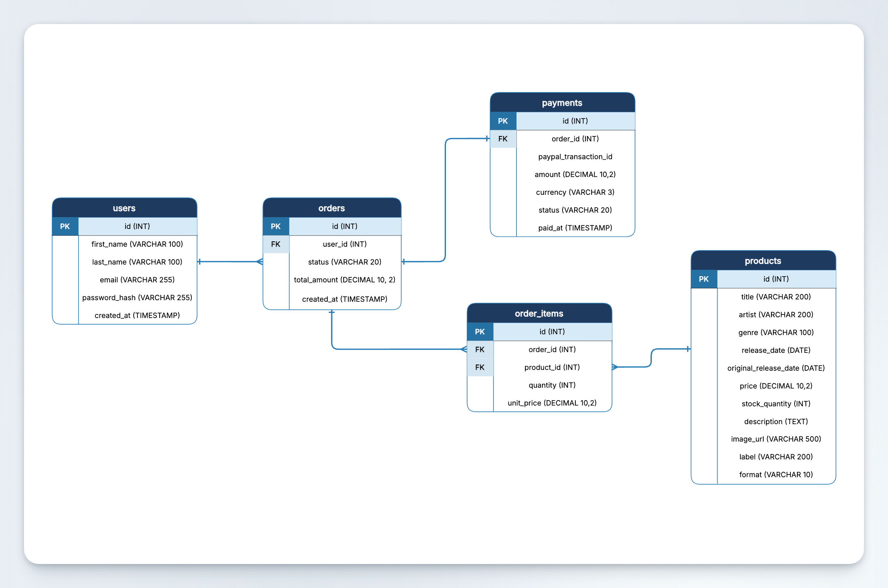

# Boutique Vinyles

**TP2 — Développement d'application mobile**
Étudiant : Eric Chandonnet

Application web de vente de vinyles en architecture 3-tiers : React + Express + MySQL.

---

## Prérequis

- Node.js
- MySQL / MariaDB
- Compte PayPal Developer (sandbox)

---

## Installation

### 1. Base de données

Ouvrir `backend/db/boutique_vinyles.sql` et exécuter les instructions souhaitées. Le fichier contient la création de la base de données `boutique_vinyles` et l'insertion de 16 produits.

### 2. Backend

```bash
cd backend
npm install
```

Créer le fichier `backend/.env` :

```
DB_HOST=localhost
DB_USER=votre_utilisateur_mysql
DB_PASSWORD=votre_mot_de_passe
DB_NAME=boutique_vinyles
SESSION_SECRET=une_phrase_longue_et_secrete
PAYPAL_CLIENT_ID=votre_client_id_paypal_sandbox
PAYPAL_SECRET=votre_secret_paypal_sandbox
```

Démarrer le serveur :

```bash
npm run dev
```

Le backend tourne sur `http://localhost:3000`.

### 3. Frontend

```bash
cd frontend
npm install
```

Créer le fichier `frontend/.env` :

```
VITE_PAYPAL_CLIENT_ID=votre_client_id_paypal_sandbox
```

Démarrer l'application :

```bash
npm run dev
```

Le frontend tourne sur `http://localhost:5173`.

---

## Comptes PayPal sandbox

Pour tester les paiements, utilisez les comptes sandbox fournis dans le tableau de bord PayPal Developer (`developer.paypal.com` → Sandbox → Accounts).

---

## Fonctionnalités

- Inscription et connexion (mots de passe hachés avec bcrypt, sessions)
- Catalogue de 16 vinyles avec images et extraits audio
- Panier persisté en session (survit au rafraîchissement)
- Paiement via l'API PayPal (sandbox) — intégration côté serveur avec `@paypal/paypal-server-sdk`
- Historique des commandes par client avec détail des items
- Redirection automatique vers la page de commandes après paiement

---

## Routes API backend

**`auth.js`**
| Méthode | Route | Description |
|---------|-------|-------------|
| POST | `/auth/register` | Crée un compte, hache le mot de passe, démarre une session |
| POST | `/auth/login` | Vérifie email + mot de passe, démarre une session |
| POST | `/auth/logout` | Détruit la session |
| GET | `/auth/me` | Retourne l'utilisateur connecté (via le cookie de session) |

**`products.js`**
| Méthode | Route | Description |
|---------|-------|-------------|
| GET | `/api/products` | Retourne tous les vinyles (ordre aléatoire) |
| GET | `/api/products/:id` | Retourne un seul vinyle |

**`cart.js`**
| Méthode | Route | Description |
|---------|-------|-------------|
| GET | `/api/cart` | Retourne le panier de la session |
| POST | `/api/cart` | Ajoute un produit au panier (ou incrémente la quantité) |
| PUT | `/api/cart/:id` | Modifie la quantité d'un item (0 = supprime) |

**`orders.js`**
| Méthode | Route | Description |
|---------|-------|-------------|
| POST | `/api/orders` | Crée la commande en BD (3 insertions en transaction : orders, order_items, payments) |
| GET | `/api/orders` | Retourne l'historique des commandes de l'utilisateur connecté |

**`paypal.js`**
| Méthode | Route | Description |
|---------|-------|-------------|
| POST | `/api/paypal/create-order` | Crée une commande PayPal et retourne l'`orderID` |
| POST | `/api/paypal/capture-order` | Capture le paiement après approbation de l'utilisateur |

---

## Stack technique

| Couche          | Technologie                    |
|-----------------|--------------------------------|
| Frontend        | React + Vite                   |
| Backend         | Node.js + Express              |
| Base de données | MySQL / MariaDB                |
| Paiement        | PayPal Server SDK (sandbox)    |
| Auth            | express-session + bcrypt       |

---

## Diagramme entité-relation



---

## Architecture

```
BoutiqueVinyles/
├── backend/
│   ├── app.js              # Point d'entrée, config Express + sessions
│   ├── db/
│   │   ├── mysql.js        # Connexion MySQL
│   │   └── boutique_vinyles.sql  # Schéma + données
│   └── routes/
│       ├── auth.js         # Inscription, connexion, déconnexion
│       ├── cart.js         # Gestion du panier en session
│       ├── orders.js       # Création et historique des commandes
│       ├── paypal.js       # Intégration API PayPal (create + capture)
│       └── products.js     # Liste et détail des produits
└── frontend/
    └── src/
        ├── components/     # Header, Layout, ProductCard...
        ├── contexts/       # AuthContext (état de connexion global)
        ├── pages/          # HomePage, ProductPage, CartPage, OrdersPage...
        └── services/
            └── api.js      # Toutes les fonctions d'appel au backend
```
